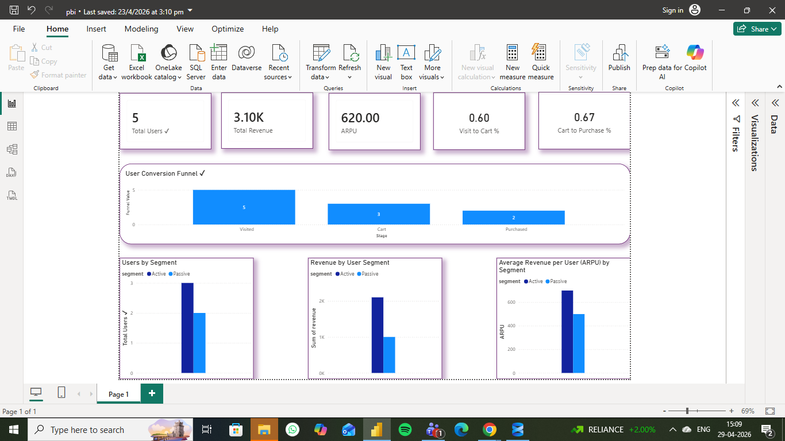

# Customer Funnel & Revenue Analysis

## 📌 Business Problem

Analyze how users move through the funnel (Visit → Add to Cart → Purchase) and identify where drop-offs occur and how they impact revenue.

---

## 📊 Key Metrics

* Total Users
* Total Revenue
* ARPU (Average Revenue per User)
* Visit → Cart Conversion Rate
* Cart → Purchase Conversion Rate

---

## 🧱 Data Overview

* Events: User actions (visit, add_to_cart, purchase)
* Orders: Transaction data
* Payments: Payment status
* User Mapping: User to customer mapping

---

## ⚙️ Approach

* Cleaned invalid dates and removed negative transactions
* Filtered only successful payments
* Built funnel using SQL (CTEs, aggregations)
* Calculated user segments (Active vs Passive)
* Developed Power BI dashboard for visualization

---

## 📈 Key Insights

* ~40% users drop before reaching the cart stage
* Cart to purchase conversion is strong (~67%)
* Active users contribute majority of revenue
* Passive users show low engagement and lower ARPU

---

## ⚠️ Edge Cases

* Users with purchase but no visit event
* Invalid or missing order data

---

## ✅ Validation Checks

* Revenue reconciled with filtered transaction data
* Distinct user counts verified across funnel stages

---

## 📊 Dashboard

---

## 🛠️ Tools Used

* SQL (Data cleaning, transformation, analysis)
* Power BI (Dashboard & visualization)

---
